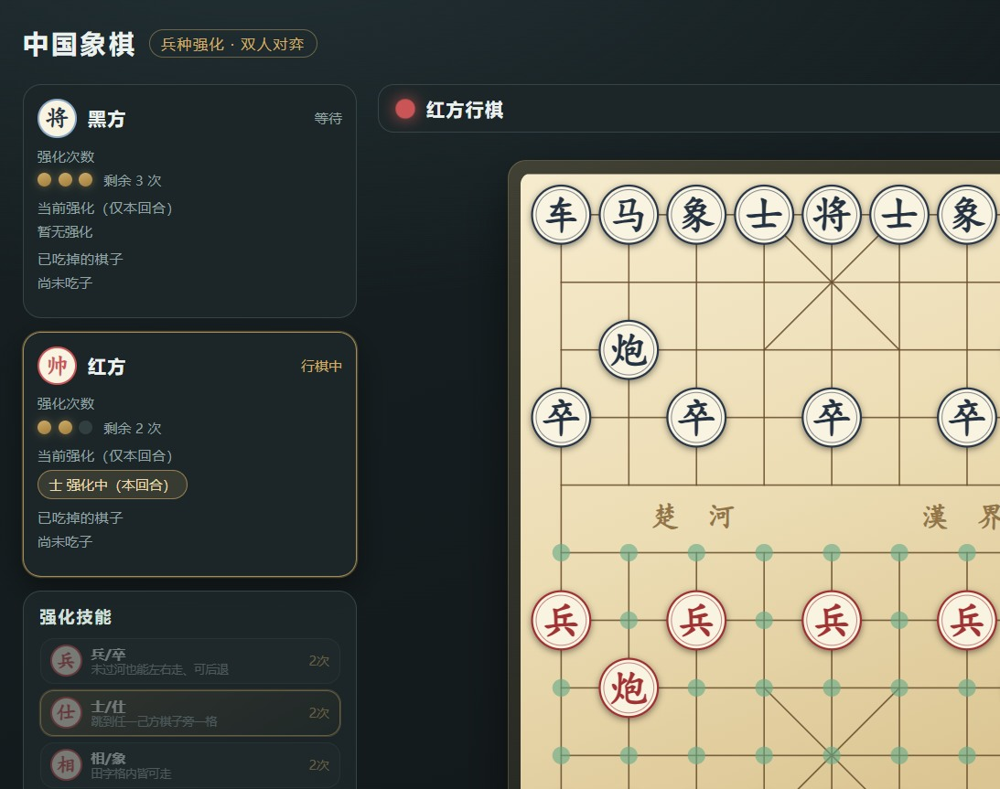

# 中国象棋 · 兵种强化版

> 一个可以直接在浏览器里双人对弈的中国象棋，带一套原创的「兵种强化」技能系统。
>
> A vanilla-JS Chinese Chess (Xiangqi) web game for two players, featuring an original **piece-enhancement skill system**, capture taunts and voice lines. Zero dependencies, no build step.

<p align="center">
  
</p>

**特色一览**

- ♟ **完整象棋规则**：将帅照面、塞象眼、别马腿、九宫、过河，一个不少；含将军提示、绝杀、困毙、60 回合判和
- 🎯 **7 种兵种强化**：兵、士、相、马、车、炮、将帅各有一个"强化形态"，每方每局 3 次机会
- 🗣 **吃子嘲讽 + 语音朗读**：吃掉对方棋子会自动甩出一句嘲讽，可开启中文 TTS 朗读
- 🧩 **零依赖**：纯原生 JS + SVG，没有框架、没有打包工具，双击 `index.html` 就能玩
- ✅ **规则有测试**：`node tests/engine.test.js` 共 158 项断言，全部通过

---

## 快速开始

### 方式一：直接打开（最简单）

双击 `index.html` 即可。项目没有构建步骤，也不依赖任何服务端。

### 方式二：本地起个服务（推荐，行为与线上一致）

```bash
# 任选其一
python -m http.server 8777
npx serve .
```

然后访问 <http://127.0.0.1:8777/index.html>。

### 运行规则测试

需要 Node.js（仅用于跑测试，游戏本身不需要）：

```bash
node tests/engine.test.js
```

```
通过 158 项，失败 0 项
全部通过 ✓
```

---

## 玩法

两位玩家共用一块屏幕轮流走子（红先）。

| 操作 | 说明 |
| --- | --- |
| 点击棋子 | 选中，棋盘上会用绿点标出所有可落子位置 |
| 点击目标 | 落子；若目标有敌子则显示红圈表示可以吃 |
| 点击空白 / `Esc` | 取消选中 |
| `U` | 悔棋一步（可一直退到开局） |
| `N` | 重新开局 |
| 顶栏按钮 | 音效开关 / 语音开关 / 规则说明 / 悔棋 / 新对局 |

侧栏会显示双方的**剩余强化次数**、**当前生效的强化**、以及**已吃掉的棋子**。

---

## 强化系统

每位玩家每局有 **3 次**强化机会，可自由分配给任意兵种。**同一回合只能发动一次**，发动强化**不消耗走子**，你还可以正常走一步。

除将帅外，强化效果**只维持一回合**（= 本方这一步 + 对方下一步），到本方下次行棋时自动失效。

| 兵种 | 强化效果 | 说明 |
| --- | --- | --- |
| **兵 / 卒** | 过河前也能左右横走，还能后退一格 | 未过河的小兵从此不再是"只能往前挪"的摆设 |
| **士 / 仕** | 可出现在任一己方棋子周围相邻一格 | 全盘可达、能离开九宫、也能借此吃子 |
| **相 / 象** | 田字格内任意一步皆可走 | 额外获得斜一格的能力（不看象眼），但仍不能过河；斜二格照旧受象眼限制 |
| **马** | 日字格内皆可走 | 不再别马腿，还能走到身旁一格（含斜向） |
| **车** | 可沿斜线方向直线滑行 | 变成"斜车"，八个方向都能走 |
| **炮** | 可吃最近一个棋子之后的任意敌方棋子 | 只要越过一个炮架，后面第几个子都能吃 |
| **帅 / 将** | 招降周围一格内的全部敌方棋子 | **即时生效**：发动瞬间结算，不占走子、不留持续状态 |

<p align="center">
  
  
</p>

### 几个关键设计决定

这几处是**有意为之**的取舍，不是遗漏：

1. **炮不能越子擒王。** 按字面实现"吃最近一个棋子之后的任意棋子"时，红方只要发动炮的强化再走一步「炮二平五」，就能以中兵为炮架越过黑卒直接吃掉黑将——**开局一步必胜**，游戏会立刻失去意义。因此把"将/帅"排除在超远吃子之外；常规炮架打将照旧。想还原无限制版本，改动点在 `js/engine.js` 里炮的强化分支。
2. **强化按"兵种"生效，而不是单个棋子。** 发动「兵」的强化是 5 个兵同时生效，这才配得上"兵种强化"的说法，也值得花掉一次宝贵机会。
3. **招降只改颜色、不挪位置。** 因为它不会移动自己的将帅，所以**一定能解掉贴身的将军**（黑车将军时，一招招降它就成你的车了），不会出现"越招降越危险"的怪事。招降来的棋子会立刻享受你本方该兵种的强化状态。
4. **士的锚点不包含它自己。** 否则强化士就退化成"随便走一步"，失去了"跳到别的棋子身边"的玩法特色。
5. **无敌子可招降时，将帅技能会置灰。** 避免误点白白浪费一次机会。

---

## 吃子嘲讽

每次吃掉对方棋子（以及招降成功）都会自动向对手发一句嘲讽，同时出现在：

- 屏幕中央的大字弹幕（飞入 + 淡出）
- 右侧「棋桌对话」区，形成一段聊天记录

嘲讽语按场景分级：吃兵卒、吃大子（车马炮）、吃士象、连续吃子、用强化吃子、将军、绝杀困毙、招降，各有专属台词。

点击顶栏 **🗣 语音朗读** 可开启中文 TTS（使用浏览器 `SpeechSynthesis`，声音取决于系统已安装的语音包）。红黑两方会使用不同音调。

---

## 项目结构

```
index.html            页面结构（棋盘 SVG + 侧栏面板）
css/style.css         全部样式：棋盘、棋子、技能栏、弹窗、响应式
js/engine.js          规则引擎：走法生成、合法性、强化、胜负判定、中文记谱
js/taunts.js          嘲讽语库 + 语音朗读封装
js/ui.js              SVG 棋盘渲染、点击交互、技能面板、音效、动画
tests/engine.test.js  引擎单元测试（node 直接运行，无需测试框架）
docs/                 README 用的截图
```

`js/engine.js` 用 UMD 包装，既能被浏览器 `<script>` 直接加载，也能被 Node `require`，所以规则测试不需要任何构建或模拟环境。

### 棋盘坐标约定

- 棋盘是一维数组，`index = row * 9 + col`
- `col` 0→8 为红方视角的左到右；`row` 0 是黑方底线（屏幕上方），`row` 9 是红方底线
- 大写字母 = 红方，小写 = 黑方：`K/k` 帅将 `A/a` 仕士 `B/b` 相象 `N/n` 马 `R/r` 车 `C/c` 炮 `P/p` 兵卒

引擎自带 FEN 解析与导出（`fromFen` / `toFen`），方便复现和调试局面。

---

## 技术实现

| 方面 | 做法 |
| --- | --- |
| 棋盘渲染 | 手写 SVG（viewBox 920×1020），棋盘线与九宫在构建时一次性生成 |
| 点击定位 | 按 viewBox 实际缩放与 letterbox 居中偏移换算，保证落点精确 |
| 走法生成 | 逐子生成伪合法着法 → 试走一步 → 检查己方将帅是否被攻击，过滤出合法着法 |
| 将帅照面 | 直接生成"飞将吃将"的着法，由合法性过滤自动禁止送将 |
| 悔棋 | 每步前对状态做快照入栈，可完整还原棋盘、行棋方、强化次数与强化状态 |
| 音效 | `WebAudio` 实时合成，无外部音频文件 |
| 语音 | `SpeechSynthesis`，自动挑选中文语音 |

---

## 浏览器支持

Chrome / Edge / Firefox / Safari 的现代版本均可。语音朗读依赖系统中文语音包，没有时会静默降级（不影响游戏）。

布局是响应式的：宽屏为三栏（玩家信息 + 技能面板 / 棋盘 / 记录与对话），窄屏自动收成单栏。

---

## 可以怎么改

| 想改什么 | 改哪里 |
| --- | --- |
| 强化次数（默认 3 次） | `js/engine.js` → `fromFen` 里的 `uses` 初始值 |
| 强力效果维持时长（默认一回合） | `js/engine.js` → `activateSkill` 里的 `state.plyCount + 2` |
| 炮的"不能擒王"限制 | `js/engine.js` → 炮分支里 `typeOf(t3) !== 'K'` 这一行 |
| 嘲讽台词 | `js/taunts.js` 顶部的 `POOLS` |
| 配色 / 棋盘质感 | `css/style.css` 顶部的 CSS 变量 |

改完记得跑一遍 `node tests/engine.test.js`——引擎部分的规则断言比较全，改错了基本会当场报出来。

---

## 已知限制

- 只支持**同屏双人**：没有联网对战，也没有 AI 对手
- 没有棋谱导入/导出（只有引擎层面的 FEN，界面上还没接）
- 悔棋只影响棋盘状态，已经发出的嘲讽记录不会一起回退

## 许可证

[MIT](LICENSE) © 2026 Zbh5031

棋子和棋盘图案全部由代码绘制，未使用任何第三方美术资源。
